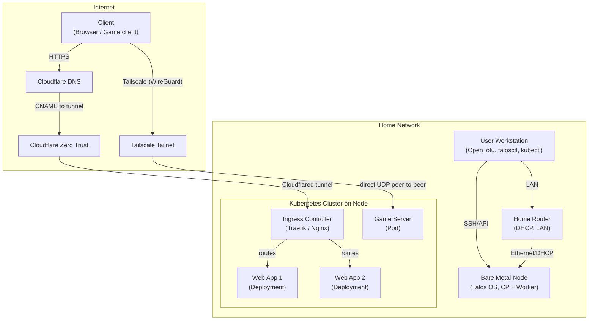

# Talos Homelab

A bare-metal Kubernetes homelab using [Talos Linux](https://www.talos.dev/docs/) for secure, immutable cluster management and OpenTofu for infrastructure as code.

## Overview

This project provisions a Talos-based Kubernetes cluster on bare metal, using OpenTofu for declarative infrastructure management. It is designed for single-node or multi-node clusters and follows best practices for reproducibility and security.

## Quick Start

1. Clone this repository.
2. Copy and edit `infrastructure/terraform.tfvars.example` to `terraform.tfvars` with your environment details.
3. Boot the Talos nodes using the `metal-amd64.iso` downloaded from the [image factory](https://factory.talos.dev/) or the [siderolabs/talos releases page](https://github.com/siderolabs/talos/releases)
4. Initialize and apply the OpenTofu configuration:

	 ```sh
	 cd infrastructure
	 tofu init
	 tofu plan
	 tofu apply
	 ```

## Directory Structure

```
infrastructure/
├── cloudflare.tf            # Cloudflare resource configuration
├── outputs.tf               # Output values (e.g., kubeconfig)
├── providers.tf             # Provider and OpenTofu version constraints
├── talos.tf                 # Talos resource configuration
├── terraform.tfvars.example # Example variable values for customization
├── terraform.tfvars         # User-specific variable values (not committed)
├── variables.tf             # Variable definitions and defaults
└── files/                   # Talos config and patch templates
```

## Architecture



## References

- [Talos documentation](https://www.talos.dev/docs/)
- [OpenTofu documentation](https://opentofu.org/docs/)
- [Talos OpenTofu provider](https://registry.opentofu.org/providers/siderolabs/talos/latest/docs)
- [Kubernetes documentation](https://kubernetes.io/docs/)
- [Cloudflared System Extension](https://github.com/siderolabs/extensions/blob/main/network/cloudflared/README.md)
- [Tailscale System Extension](https://github.com/siderolabs/extensions/blob/main/network/tailscale/README.md)
