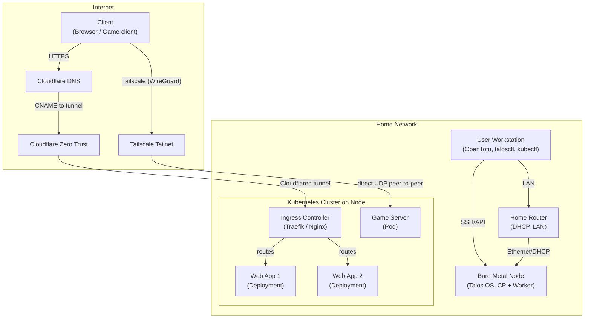

# Talos Homelab

A bare-metal Kubernetes homelab using [Talos Linux](https://www.talos.dev/docs/) for secure, immutable cluster management and OpenTofu for infrastructure as code.

## Overview

This project provisions a Talos-based Kubernetes cluster on bare metal, using OpenTofu for declarative infrastructure management. It is designed for single-node or multi-node clusters and follows best practices for reproducibility and security.

## Quick Start

1. Clone this repository.
2. Copy and edit `infrastructure/terraform.tfvars.example` to `terraform.tfvars` with your environment details.
3. Boot the Talos nodes using the `metal-amd64.iso` downloaded from the [image factory](https://factory.talos.dev/) or the [siderolabs/talos releases page](https://github.com/siderolabs/talos/releases).
4. Initialize and apply the OpenTofu configuration (this also installs Argo CD and Sealed Secrets via Helm releases defined in `infrastructure/`):

```sh
cd infrastructure
tofu init
tofu plan
tofu apply
```

### Post Installation

After `tofu apply` the Helm releases for Argo CD and the Sealed Secrets controller should be present. Use the following steps to verify and finish bootstrapping the GitOps workflow.

1. Verify Argo CD pods are running (and the namespace matches your `infrastructure` configuration):

```sh
kubectl -n argocd get pods
kubectl -n argocd rollout status deploy/argocd-server
```

2. Retrieve the initial Argo CD admin password (same secret name as standard chart installs):

```sh
kubectl get secret argocd-initial-admin-secret -n argocd -o jsonpath='{.data.password}' | base64 -d
```

3. Port-forward the Argo CD API server to access the UI locally:

```sh
kubectl port-forward svc/argocd-server -n argocd 8080:80
```

4. Apply the repository root app-of-apps so Argo CD takes over managing cluster applications:

```sh
kubectl apply -k cluster/bootstrap
```

5. Optionally verify the Sealed Secrets controller (namespace may vary; check your `infrastructure` Helm release):

```sh
kubectl -n sealed-secrets get pods || kubectl -n kubeseal get pods
```

6. Login to the Argo CD UI using the initial admin password and watch your Applications sync.

Notes:
- If Argo CD or Sealed Secrets are installed to different namespaces in your OpenTofu manifests, substitute the correct namespace when running the commands above.
- For recovery, re-run `tofu apply` to restore the Helm releases and re-apply `kubectl apply -k cluster/bootstrap` if needed; Argo CD will then resync managed Applications.

## Directory Structure

```sh
infrastructure/
├── bootstrap.tf             # Initial Helm release configuration
├── cloudflare.tf            # Cloudflare resource configuration
├── outputs.tf               # Output values (e.g., kubeconfig)
├── providers.tf             # Provider and OpenTofu version constraints
├── talos.tf                 # Talos resource configuration
├── terraform.tfvars.example # Example variable values for customization
├── terraform.tfvars         # User-specific variable values (not committed)
├── variables.tf             # Variable definitions and defaults
└── files/                   # Talos config and patch templates

cluster/
├── bootstrap/               # ArgoCD bootstrap Application, kustomization, aggregation
│   ├── bootstrap.yaml       # Bootstrap ArgoCD Application manifest
│   ├── kustomization.yaml   # Aggregates all ArgoCD Applications and Projects
│   ├── applications/        # ArgoCD Application manifests (one per app)
│   └── projects/            # ArgoCD AppProject manifests (scoping, RBAC, repo/namespace restrictions)
└── applications/            # Raw manifests, Helm charts, configs for individual workloads
```

## Architecture



## Argo CD & GitOps

Argo CD and Sealed Secrets are now bootstrapped by OpenTofu (see the Helm release resources in `infrastructure/`). After running your OpenTofu apply (for example `tofu apply` in `infrastructure/`), the Helm releases install Argo CD and the Sealed Secrets controller.

Once the Helm releases are present, apply the repository's root app-of-apps (the Kustomize bootstrap) so Argo CD takes over managing the rest of the applications:

```
kubectl apply -k cluster/bootstrap
```

Notes:
- You no longer need to manually install Argo CD with `kubectl apply -k applications/argocd` — it's installed by OpenTofu Helm releases.
- Recovery: if Argo CD becomes unavailable, re-run the OpenTofu apply to restore the Helm releases, then re-apply the bootstrap Kustomize if necessary; Argo CD will resync managed Applications.

### Expansion guidance
- Split into tiers (core / platform / apps) only after app count grows (>8 infra services) to avoid premature complexity.
- Consider ApplicationSets for pattern generation (multi-env, many similar apps) later.
- Always pin chart versions; avoid latest tags.
- Add sync waves only if you encounter ordering issues.

## Troubleshooting

Common networking and DNS issues encountered and their resolutions.

### Kubelet node IP selection on multi-interface nodes

On Talos with multiple interfaces (e.g. Tailscale/tunnel + LAN), kubelet may auto-select the tunnel IP as the node InternalIP. When that happens:
- `kubectl get node` shows only the tunnel IP
- NodePort services are unreachable on the LAN IP (connection refused)
- ClusterIP services still work

Fix: explicitly pin the LAN address with `machine.kubelet.extraArgs.node-ip`:

```yaml
machine:
  network:
    interfaces:
      - interface: eno1
        addresses:
          - 192.168.50.200/24
  kubelet:
    extraArgs:
      node-ip: 192.168.50.200
```

### Sealed Secrets

Sealed Secrets is a tool for managing sensitive data in Kubernetes. It allows you to encrypt your secrets into a "sealed" format that can be safely stored in version control. The sealed secrets controller then decrypts the sealed secrets at runtime, making the original secret values available to your applications.

Whenever you redeploy the sealed-secrets controller, you need to re-generate the sealed secrets and commit them to the repo. Follow these steps:

1. Create a new `kustomization.yaml` with your new plaintext secret:

```bash
cat << EOF > kustomization.yaml
namespace: cloudflared
secretGenerator:
- name: tunnel-token
  literals:
  - token=<your-tunnel-token>
generatorOptions:
  disableNameSuffixHash: true
EOF
kubectl kustomize . > secret.yaml
```

2. Use `kubeseal` to create a Sealed Secret:

```bash
kubeseal \
  --controller-namespace kubeseal \
  --controller-name sealed-secrets \
  --format=yaml \
  < secret.yaml > sealed-secret.yaml
```

3. Delete `secret.yaml`, move `sealed-secret.yaml` to the appropriate directory, and commit the `sealed-secret.yaml`.

## References

- [Talos documentation](https://www.talos.dev/docs/)
- [OpenTofu documentation](https://opentofu.org/docs/)
- [Talos OpenTofu provider](https://registry.opentofu.org/providers/siderolabs/talos/latest/docs)
- [Kubernetes documentation](https://kubernetes.io/docs/)
- [Cloudflared System Extension](https://github.com/siderolabs/extensions/blob/main/network/cloudflared/README.md)
- [Tailscale System Extension](https://github.com/siderolabs/extensions/blob/main/network/tailscale/README.md)
- [Managing secrets deployment in Kubernetes using Sealed Secrets](https://aws.amazon.com/blogs/opensource/managing-secrets-deployment-in-kubernetes-using-sealed-secrets/)
