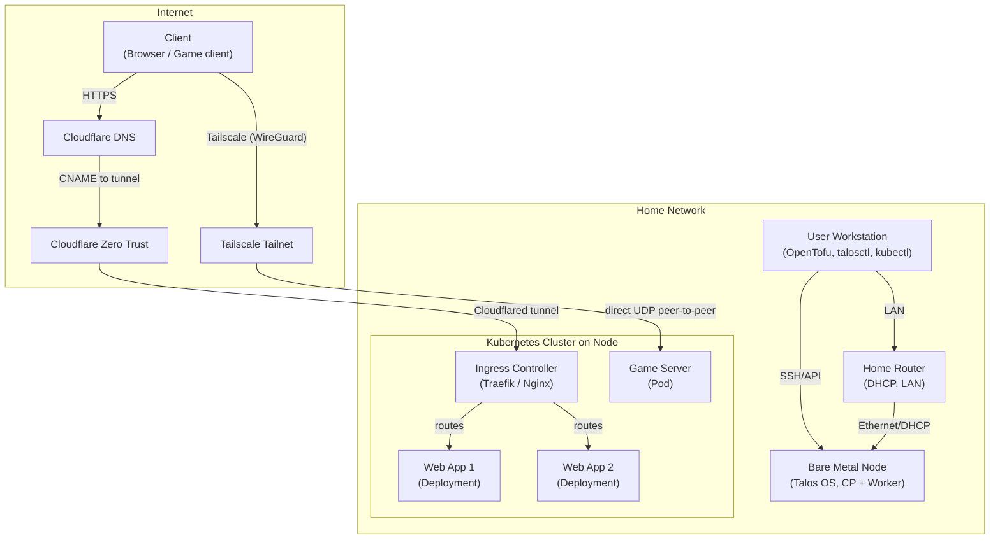

# Talos Homelab

A bare-metal Kubernetes homelab using [Talos Linux](https://www.talos.dev/docs/) for secure, immutable cluster management and OpenTofu for infrastructure as code.

## Overview

This project provisions a Talos-based Kubernetes cluster on bare metal, using OpenTofu for declarative infrastructure management. It is designed for single-node or multi-node clusters and follows best practices for reproducibility and security.

## Quick Start

1. Clone this repository.
2. Copy and edit `infrastructure/terraform.tfvars.example` to `terraform.tfvars` with your environment details.
3. Boot the Talos nodes using the `metal-amd64.iso` downloaded from the [image factory](https://factory.talos.dev/) or the [siderolabs/talos releases page](https://github.com/siderolabs/talos/releases)
4. Initialize and apply the OpenTofu configuration:

	 ```sh
	 cd infrastructure
	 tofu init
	 tofu plan
	 tofu apply
	 ```

## Directory Structure

```
infrastructure/
├── cloudflare.tf            # Cloudflare resource configuration
├── outputs.tf               # Output values (e.g., kubeconfig)
├── providers.tf             # Provider and OpenTofu version constraints
├── talos.tf                 # Talos resource configuration
├── terraform.tfvars.example # Example variable values for customization
├── terraform.tfvars         # User-specific variable values (not committed)
├── variables.tf             # Variable definitions and defaults
└── files/                   # Talos config and patch templates
```

## Architecture



## Argo CD Management Strategy

Argo CD itself is currently installed and upgraded with Helm (a single Helm release in the `argocd` namespace). All *other* applications are managed declaratively as Argo CD `Application` resources ("app-of-apps" model). Rationale for keeping Argo CD Helm-managed:
1. Simpler bootstrap: no chicken-and-egg self‑management during the earliest cluster bring-up.
2. Easier break‑glass recovery: a failed Git commit cannot remove Argo CD itself; reinstall is one Helm command.
3. Clear upgrade control: you explicitly `helm upgrade` Argo CD after reviewing release notes.

Upgrade paths:
- Argo CD (Helm managed):
	- Check chart version diff: `helm repo update && helm search repo argo/argo-cd --versions | head`
	- Upgrade: `helm upgrade -n argocd argocd argo/argo-cd --version <x.y.z>`
	- Verify: `kubectl -n argocd rollout status deploy/argocd-server`
- GitOps apps (Argo CD managed):
	- Bump chart/app versions in the corresponding Application source (values or chart version) and commit.
	- Argo CD reconciles automatically (or click Sync). Rollback = `git revert` the commit.

Recovery (break‑glass) note:
If Argo CD becomes unhealthy, you can reapply it with Helm without touching other workloads, then let GitOps resume.

### GitOps layout & bootstrap

Directory roles (under `cluster/`):
- `app-of-apps/` Root bootstrap Application + `kustomization.yaml` aggregating all others.
- `apps/` Individual Argo CD `Application` manifests (infra + homelab apps).
- `projects/` (future) Argo CD `AppProject` definitions to scope repos/namespaces.

Bootstrap flow:
1. Install Argo CD via Helm (see upgrade section below) to get a controller running.
2. Apply `cluster/app-of-apps/bootstrap.yaml` once the Talos control plane is healthy.
3. The app-of-apps Application syncs and pulls in everything listed in `cluster/app-of-apps/kustomization.yaml`.
4. Add a new app: commit its manifest under `cluster/apps/` and reference it in the kustomization.

Why Helm for Argo CD (recap):
| Reason | Benefit |
| ------ | ------- |
| Bootstrap simplicity | Avoid self-referential Application early on |
| Safer experiments | Git mistakes can't delete the controller |
| Explicit upgrades | Manual `helm upgrade` after review |

### Upgrading Argo CD (Helm-managed)
1. `helm repo update`
2. Pick version: `helm search repo argo/argo-cd --versions | head`
3. `helm upgrade -n argocd argocd argo/argo-cd --version <x.y.z>`
4. `kubectl -n argocd rollout status deploy/argocd-server`

### Upgrading other apps (GitOps-managed)
- Bump chart version / image tag in the app's manifest.
- Commit & push; Argo CD reconciles.
- Roll back with `git revert`.

### Sync ordering (optional)
Defer sync waves until you have a concrete dependency issue. When needed, annotate specific Application manifests with `argocd.argoproj.io/sync-wave`.

### Expansion guidance
- Split into tiers (core / platform / apps) only after app count grows (>8 infra services) to avoid premature complexity.
- Consider ApplicationSets for pattern generation (multi-env, many similar apps) later.
- Always pin chart versions; avoid latest tags.

### Security notes
- Use AppProjects to restrict allowed repos and destination namespaces (introduce when needed).
- Plan secret management (External Secrets, SOPS, Sealed Secrets) for sensitive values.

### Next steps (roadmap)
- Add Traefik / cert-manager / external-dns / monitoring stack as new Application manifests.
- Introduce secret management solution.

## Troubleshooting

Common networking and DNS issues encountered and their resolutions.

### Kubelet node IP selection on multi-interface nodes

On Talos with multiple interfaces (e.g. Tailscale/tunnel + LAN), kubelet may auto-select the tunnel IP as the node InternalIP. When that happens:
- `kubectl get node` shows only the tunnel IP
- NodePort services are unreachable on the LAN IP (connection refused)
- ClusterIP services still work

Fix: explicitly pin the LAN address with `machine.kubelet.extraArgs.node-ip`:

```yaml
machine:
	network:
		interfaces:
			- interface: eno1
				addresses:
					- 192.168.50.200/24
	kubelet:
		extraArgs:
			node-ip: 192.168.50.200
```

### Cluster DNS & Cloudflare tunnel (Service FQDN access)

Two issues when pointing the tunnel directly at Service FQDNs (ClusterIP):
- `503` (`No ingress rules were defined`) because DNS existed before tunnel ingress rules.
- Intermittent `*.svc.cluster.local` lookup failures until node IP and nameservers were pinned.

Fixes:
- Terraform `cloudflare_zero_trust_tunnel_cloudflared_config` (one ingress per app + 404 fallback).
- Each app `service_url` set to its Service FQDN (ClusterIP, not NodePort).
- Explicit nameservers with CoreDNS first, then public:

```yaml
machine:
	network:
		nameservers:
			- 10.96.0.10   # CoreDNS ClusterIP (serviceSubnets 10.96.0.0/12 -> .10 assigned to kube-dns)
			- 1.1.1.1      # Public recurse
			- 1.0.0.1
```

Why 10.96.0.10: service subnet is 10.96.0.0/12 and CoreDNS (kube-dns) commonly gets .10.

Result: cloudflared reliably resolves and dials ClusterIP Services; Access policies protect external hostnames—no ingress controller needed for these apps.

Change Service CIDR later: update `serviceSubnets`, check `kubectl -n kube-system get svc kube-dns` for new CoreDNS IP (usually `<base>.10`), update nameserver list.

### Cloudflare tunnel scaling & HA

Each Talos node includes the cloudflared system extension with the same tunnel token, so every new node automatically adds another connector to the existing tunnel:
- Multiple connectors = higher availability; Cloudflare edge load balances requests across active connections.
- Each connector opens several outbound connections; edge fails over transparently if one drops.
- After a request reaches a connector, Kubernetes Service (ClusterIP) load balancing (iptables/IPVS/eBPF) spreads traffic across pods.
- Combined effect: external (Cloudflare) + internal (Service) load balancing without an ingress controller for these tunneled apps.

Operations:
- View connector count: Zero Trust > Tunnels > select tunnel.
- Token rotation: create new token, update Talos secret/variable, roll nodes (old connections drop, new attach).
- To exclude a node: omit the cloudflared extension or token in that node's config patch.
- Avoid per-node tunnels unless you need isolation; a shared tunnel simplifies DNS and Access policies.


## References

- [Talos documentation](https://www.talos.dev/docs/)
- [OpenTofu documentation](https://opentofu.org/docs/)
- [Talos OpenTofu provider](https://registry.opentofu.org/providers/siderolabs/talos/latest/docs)
- [Kubernetes documentation](https://kubernetes.io/docs/)
- [Cloudflared System Extension](https://github.com/siderolabs/extensions/blob/main/network/cloudflared/README.md)
- [Tailscale System Extension](https://github.com/siderolabs/extensions/blob/main/network/tailscale/README.md)
