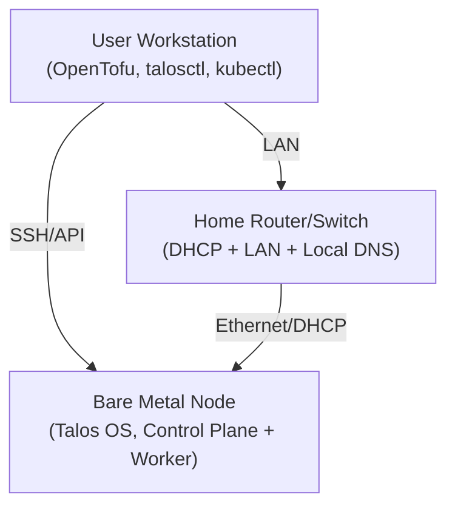

# Talos Homelab

A bare-metal Kubernetes homelab using [Talos Linux](https://www.talos.dev/docs/) for secure, immutable cluster management and OpenTofu for infrastructure as code.

## Overview

This project provisions a Talos-based Kubernetes cluster on bare metal, using OpenTofu for declarative infrastructure management. It is designed for single-node or multi-node clusters and follows best practices for reproducibility and security.

## Quick Start

1. Clone this repository.
2. Copy and edit `infrastructure/terraform.tfvars.example` to `terraform.tfvars` with your environment details.
3. Initialize and apply the OpenTofu configuration:

	 ```sh
	 cd infrastructure
	 tofu init
	 tofu plan
	 tofu apply
	 ```


4. Retrieve your `talosconfig` and `kubeconfig` from the outputs and write them to the recommended locations:

	```sh
	# Write talosconfig to ~/.talos/config
	mkdir -p ~/.talos
	tofu output -raw talosconfig > ~/.talos/config

	# Write kubeconfig to ~/.kube/talos-config
	mkdir -p ~/.kube
	tofu output -raw kubeconfig > ~/.kube/talos-config
	```

> [!WARNING]
> Do not commit sensitive files such as `kubeconfig` or `talosconfig` to version control.

## Directory Structure

```
infrastructure/
├── main.tf                  # Main OpenTofu configuration
├── variables.tf             # Variable definitions and defaults
├── outputs.tf               # Output values (e.g., kubeconfig)
├── versions.tf              # Provider and OpenTofu version constraints
├── terraform.tfvars.example # Example variable values for customization
├── terraform.tfvars         # User-specific variable values (not committed)
├── templates/               # Talos config and patch templates
└── files/                   # Additional files (e.g., config patches)
```

## Architecture



## References

- [Talos documentation](https://www.talos.dev/docs/)
- [OpenTofu documentation](https://opentofu.org/docs/)
- [Talos OpenTofu provider](https://registry.opentofu.org/providers/siderolabs/talos/latest/docs)
- [Kubernetes documentation](https://kubernetes.io/docs/)
