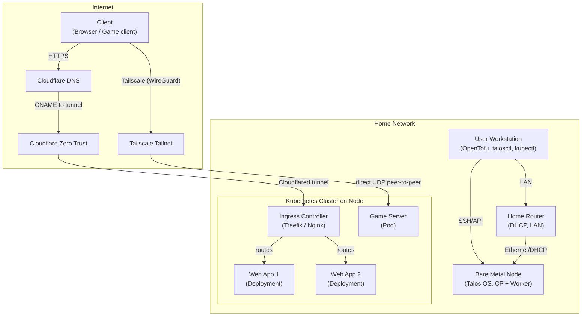

# Talos Homelab

A bare-metal Kubernetes homelab using [Talos Linux](https://www.talos.dev/docs/) for secure, immutable cluster management and OpenTofu for infrastructure as code.

## Overview

This project provisions a Talos-based Kubernetes cluster on bare metal, using OpenTofu for declarative infrastructure management. It is designed for single-node or multi-node clusters and follows best practices for reproducibility and security.

## Quick Start

1. Clone this repository.
2. Copy and edit `infrastructure/terraform.tfvars.example` to `terraform.tfvars` with your environment details.
3. Boot the Talos nodes using the `metal-amd64.iso` downloaded from the [image factory](https://factory.talos.dev/) or the [siderolabs/talos releases page](https://github.com/siderolabs/talos/releases)
4. Initialize and apply the OpenTofu configuration:

```sh
cd infrastructure
tofu init
tofu plan
tofu apply
```

### Post Installation

1. Install Argo CD:

```sh
kubectl apply -k cluster/applications/argocd
```

2. Check the status of the Argo CD components:

```sh
kubectl -n argocd get pods
kubectl -n argocd rollout status deploy/argocd-server
```

3. Get the initial admin password for Argo CD:

```sh
kubectl get secret argocd-initial-admin-secret -n argocd -o jsonpath='{.data.password}' | base64 -d
```

4. Port forward the Argo CD API server:

```sh
kubectl port-forward svc/argocd-server -n argocd 8080:80
```

5. Login to the Argo CD UI using the initial admin password obtained earlier.

6. Apply the app-of-apps boostrap application:

```sh
kubectl apply -k cluster/bootstrap
```

7. Watch magic happen in Argo CD!

## Directory Structure

```sh
infrastructure/
├── cloudflare.tf            # Cloudflare resource configuration
├── outputs.tf               # Output values (e.g., kubeconfig)
├── providers.tf             # Provider and OpenTofu version constraints
├── talos.tf                 # Talos resource configuration
├── terraform.tfvars.example # Example variable values for customization
├── terraform.tfvars         # User-specific variable values (not committed)
├── variables.tf             # Variable definitions and defaults
└── files/                   # Talos config and patch templates

cluster/
├── bootstrap/               # ArgoCD bootstrap Application, kustomization, aggregation
│   ├── bootstrap.yaml       # Bootstrap ArgoCD Application manifest
│   ├── kustomization.yaml   # Aggregates all ArgoCD Applications and Projects
│   ├── applications/        # ArgoCD Application manifests (one per app)
│   └── projects/            # ArgoCD AppProject manifests (scoping, RBAC, repo/namespace restrictions)
└── applications/            # Raw manifests, Helm charts, configs for individual workloads
```

## Architecture



## Argo CD & GitOps

Argo CD is installed and upgraded using Kustomize (`argocd` namespace). All other workloads are managed by Argo CD Applications (app-of-apps pattern). This approach enables fast bootstrap, safe recovery, and explicit upgrades.

Recovery: if Argo CD breaks, re-apply the Kustomize manifest; Applications will resync automatically.

### Upgrades

Argo CD:
```
kubectl apply -k cluster/applications/argocd
kubectl -n argocd rollout status deploy/argocd-server
```
Other apps: bump chart/image in the Application manifest, commit, push. Roll back with `git revert`.

### Expansion guidance
- Split into tiers (core / platform / apps) only after app count grows (>8 infra services) to avoid premature complexity.
- Consider ApplicationSets for pattern generation (multi-env, many similar apps) later.
- Always pin chart versions; avoid latest tags.
- Add sync waves only if you encounter ordering issues.

### Security notes
- Use AppProjects to restrict allowed repos and destination namespaces (introduce when needed).
- Plan secret management (External Secrets, SOPS, Sealed Secrets) for sensitive values.

### Next steps (roadmap)
- Add Traefik / cert-manager / external-dns / monitoring stack as new Application manifests.
- Introduce secret management solution (e.g. SOPS, Sealed Secrets).

## Troubleshooting

Common networking and DNS issues encountered and their resolutions.

### Kubelet node IP selection on multi-interface nodes

On Talos with multiple interfaces (e.g. Tailscale/tunnel + LAN), kubelet may auto-select the tunnel IP as the node InternalIP. When that happens:
- `kubectl get node` shows only the tunnel IP
- NodePort services are unreachable on the LAN IP (connection refused)
- ClusterIP services still work

Fix: explicitly pin the LAN address with `machine.kubelet.extraArgs.node-ip`:

```yaml
machine:
  network:
    interfaces:
      - interface: eno1
        addresses:
          - 192.168.50.200/24
  kubelet:
    extraArgs:
      node-ip: 192.168.50.200
```

## References

- [Talos documentation](https://www.talos.dev/docs/)
- [OpenTofu documentation](https://opentofu.org/docs/)
- [Talos OpenTofu provider](https://registry.opentofu.org/providers/siderolabs/talos/latest/docs)
- [Kubernetes documentation](https://kubernetes.io/docs/)
- [Cloudflared System Extension](https://github.com/siderolabs/extensions/blob/main/network/cloudflared/README.md)
- [Tailscale System Extension](https://github.com/siderolabs/extensions/blob/main/network/tailscale/README.md)
- [Managing secrets deployment in Kubernetes using Sealed Secrets](https://aws.amazon.com/blogs/opensource/managing-secrets-deployment-in-kubernetes-using-sealed-secrets/)
